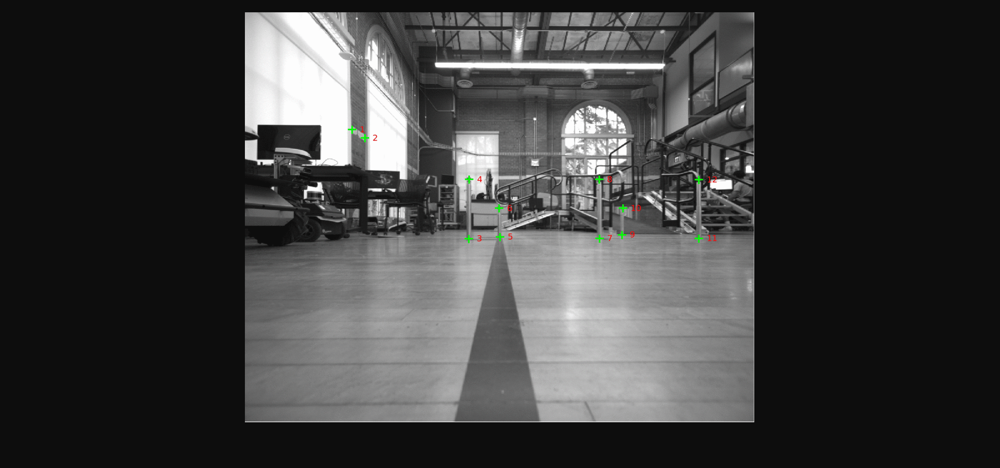

# VSLAM SET1 Sequence
The sequence contains give images acquired in the AHG level 2 AMRL lab area. The position/dimensions of the 3D scene can be reconstructed from the pictures in the [arrangement](arrangement) folder. In the first four frame 12 keypoints are picked and in the last frame only 10 are picked. The keypoint location for each frame can be found in the [labels](labels) folder. At each time step the camera moves directly forward approximately 0.1524m.

## Frame Coordinates
Frame | #1 | #2 | #3 | #4 | #5 | 
--- | --- | --- | --- |--- |--- |
Coordinate | (0, 0, 0.13, 0, 0, 0) | (0.1524, 0, 0.13, 0, 0, 0) | (0.3048, 0, 0.13, 0, 0, 0) | (0.4572, 0, 0.13, 0, 0, 0) | (0.6096, 0, 0.13, 0, 0, 0)

Note: Coordinates given as (x, y, z, ex, ey, ez) where ei is the axis-angle representation where the magnitude of the rotation is encoded as the magnitude of the vector. Units in meter and radians.

## Label Format
ID | x | y | 
--- | --- | --- | 
1 | 400 | 344 |
2 | 200 | 566 |
4 | 650 | 668 |
k | xk | yk |

The keypoints for each frame are stored in a text file. There are as many rows as there are picked keypoints. Each keypoint has a manually assigned integer ID that is consistent across all frames. The coordinates are given in pixel coordinates.