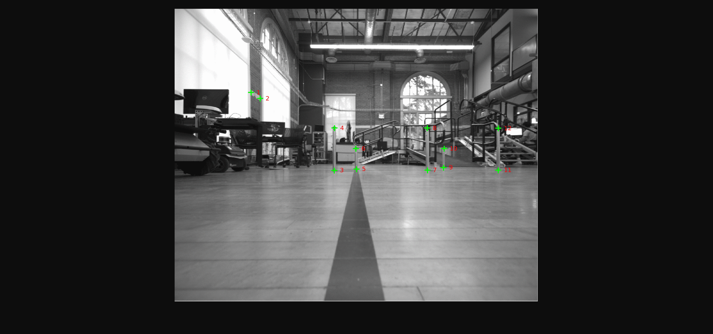

# VSLAM SET1 Sequence
The sequence contains give images acquired in the AHG level 2 AMRL lab area. The position/dimensions of the 3D scene can be reconstructed from the pictures in the [arrangement](arrangement) folder. In the first four frame 12 keypoints are picked and in the last frame only 10 are picked. The keypoint location for each frame can be found in the [labels](labels) folder. At each time step the camera moves directly forward approximately 0.1524m.

## Frame Coordinates
Frame | #1 | #2 | #3 | #4 | #5 | 
--- | --- | --- | --- |--- |--- |
Coordinate | (0, 0, 0.13, 0, 0, 0, 1) | (0.1524, 0, 0.13, 0, 0, 0, 1) | (0.3048, 0, 0.13, 0, 0, 0, 1) | (0.4572, 0, 0.13, 0, 0, 0, 1) | (0.6096, 0, 0.13, 0, 0, 0, 1)

Note: Coordinates given as (x, y, z, qx, qy, qz, qw) where qi is quaternion representation of rotation. Units are in meters.

## Label Format
ID | x | y | 
--- | --- | --- | 
1 | 400 | 344 |
2 | 200 | 566 |
4 | 650 | 668 |
k | xk | yk |

The keypoints for each frame are stored in a text file. There are as many rows as there are picked keypoints. Each keypoint has a manually assigned integer ID that is consistent across all frames. The coordinates are given in pixel coordinates.

## Data File
The first entry in the data file is the frame ID, the second is the map frame pose, and the third is the table of labeled keypoints.

## Calibration 
The images are 1024 x 1224 and their pinhole model calibration is given:  
D = [-0.03008119897795957, 0.05868843892472479, 0.0004516554495703711, -0.0022084025311091475, 0.0]  
K = [751.9833506725497, 0.0, 616.3347489267952, 0.0, 749.5459365154422, 528.085068372112, 0.0, 0.0, 1.0]  
R = [1.0, 0.0, 0.0, 0.0, 1.0, 0.0, 0.0, 0.0, 1.0]  
P = [778.0388793945312, 0.0, 612.0841219278518, 0.0, 0.0, 776.6334228515625, 527.0950631562009, 0.0, 0.0, 0.0, 1.0, 0.0]  