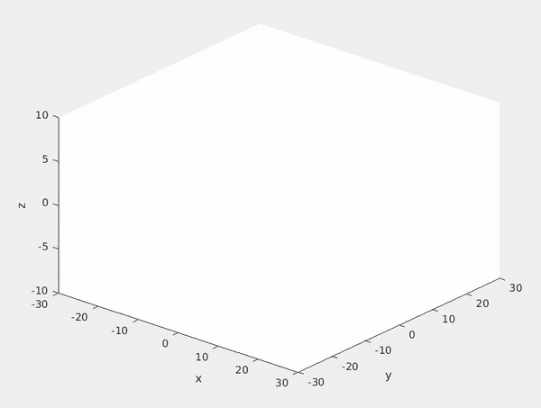

# VSLAM SET3 Sequence
The sequence contains simulated date acquired in matlab. Ground truth poses, measurements, and 3D features are available. The feature point cloud contained 10000 randomly generated points drawn from a uniform distribution.

## Frame Coordinates
Frame | #1 | #2 | #3 | #4 | #5 | 
--- | --- | --- | --- |--- |--- |
Coordinate | (0, 0, 0.13, 0, 0, 0, 1) | (0.1524, 0, 0.13, 0, 0, 0, 1) | (0.3048, 0, 0.13, 0, 0, 0, 1) | (0.4572, 0, 0.13, 0, 0, 0, 1) | (0.6096, 0, 0.13, 0, 0, 0, 1)

Note: Coordinates given as (x, y, z, qx, qy, qz, qw) where qi is quaternion representation of rotation. Units are in meters.

## Label Format
ID | x | y | 
--- | --- | --- | 
1 | 400 | 344 |
2 | 200 | 566 |
4 | 650 | 668 |
k | xk | yk |

The keypoints for each frame are stored in a text file. There are as many rows as there are keypoints. Each keypoint has a integer ID that is consistent across all frames and corresponds to a 3D feature ID. The coordinates are given in pixel coordinates.

## Data File
The first entry in the data file is the frame ID, the second is the map frame pose, and the third is the table of labeled keypoints.

## Calibration 
The images are 480 x 640 and their camera matrix is given by;  
K = [800, 0.0, 320, 0.0, 800, 240, 0.0, 0.0, 1.0]  

The camera_matrix.txt files stores the camera calibration matrix in the from "fx fy cx cy".